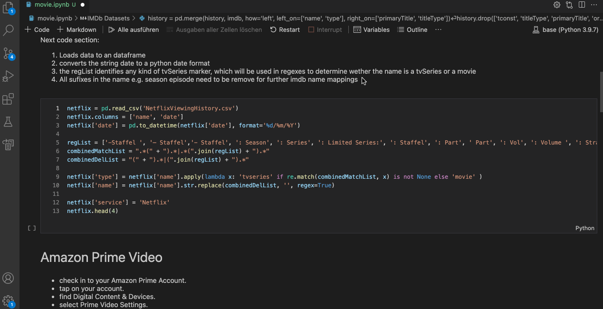
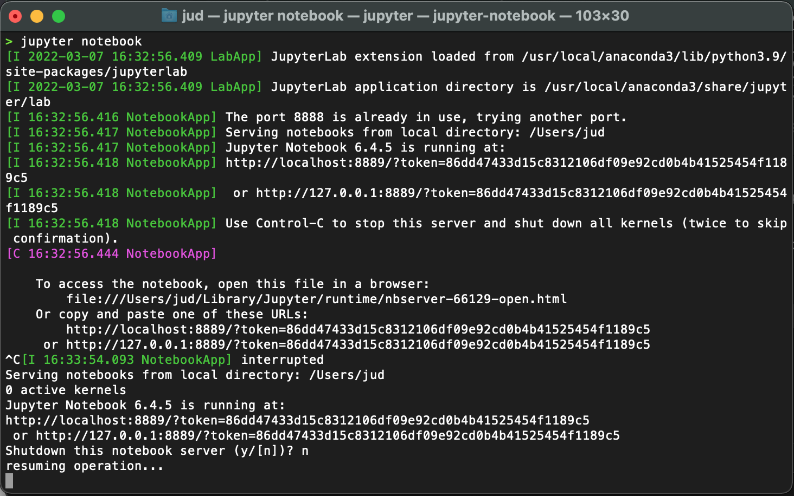

# Movie recommender

In first step I've create this Jupyter Notebook to combine my Netflix and Amazon Prime Video watch history. It should be quite easy to expand it with further streaming provider.

A part in the Notebook will normalize the given csv and txt Raw data and combine it with IMDB genre, avg rating and number of votes information.

At the moment it will output you two zip files with the history and imdb dataframes.

tbd. the recommendation engine.


## Installation
I did everthing under OSX (macOS), but it should also work for Linux and Windows.

I used Visual Studio Code, which offers a really nice integration, you read [here](https://code.visualstudio.com/docs/datascience/jupyter-notebooks) how to setup.




Before you start you need to install anaconda via brew by executing
```bash
brew install anaconda
```

Next try to execute `jupyter notebook` in your terminal, if it doesn't work, please  setup the environment path in `~/.zshrc``
```bash
export PATH="/usr/local/anaconda3/bin:$PATH"
````

Then you have to restart your terminal or use source ~/.zshrc to reload your shell environment and execute `jupyter notebook`again the result should lokk like this.


